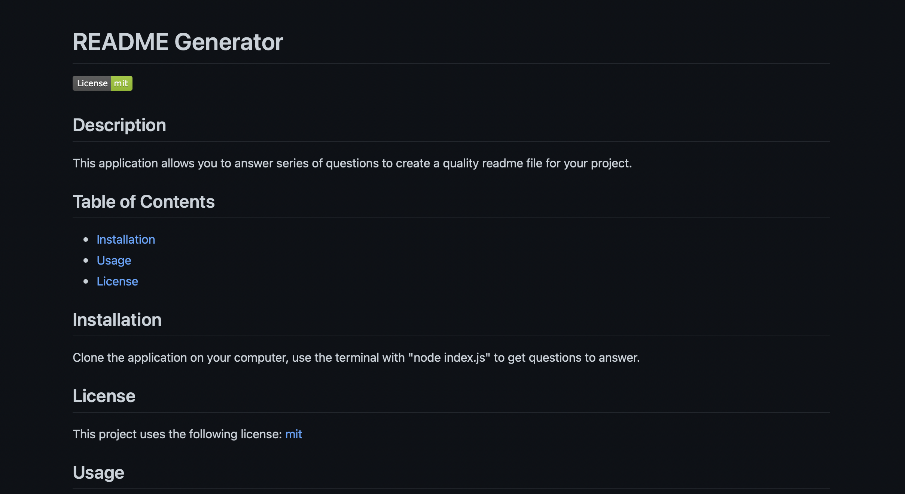

# ReadMe Generator 

  
## Description
 This application uses users answers that is obtained from inquirer prompt. Once all answers are obtained a new readme file is created in the src directory 
   
## Table of Contents

  - [Installation](#Installation)
  - [Usage](#Usage)
  - [License](#License)
  - [Questions](#Questions)

## Installation
   npm init to get the package.json and npm install inquirer to get the node module.

## License
  
  This project uses the following license: [mit](https://choosealicense.com/licenses/mit/)
  

## Usage

while in the main directory run node index.js in the terminal

## Questions
If you have any Questions, reach me at [Email](mukey6@gmail.com), [Github](https://github.com/mukey6)
    
 
## Contributing 
  You can contribute to the project as you like